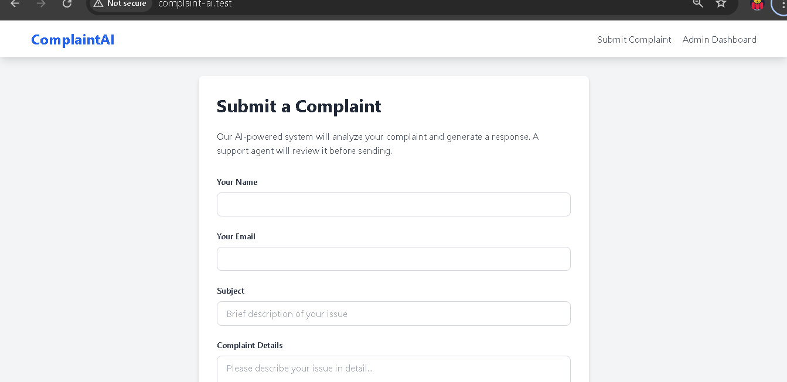
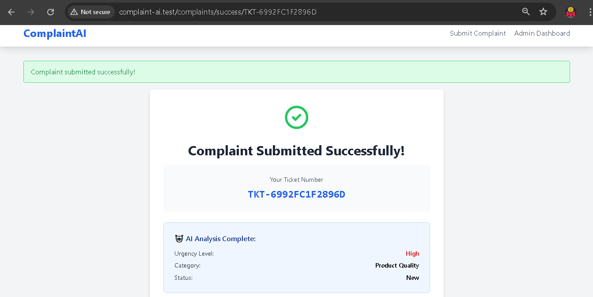
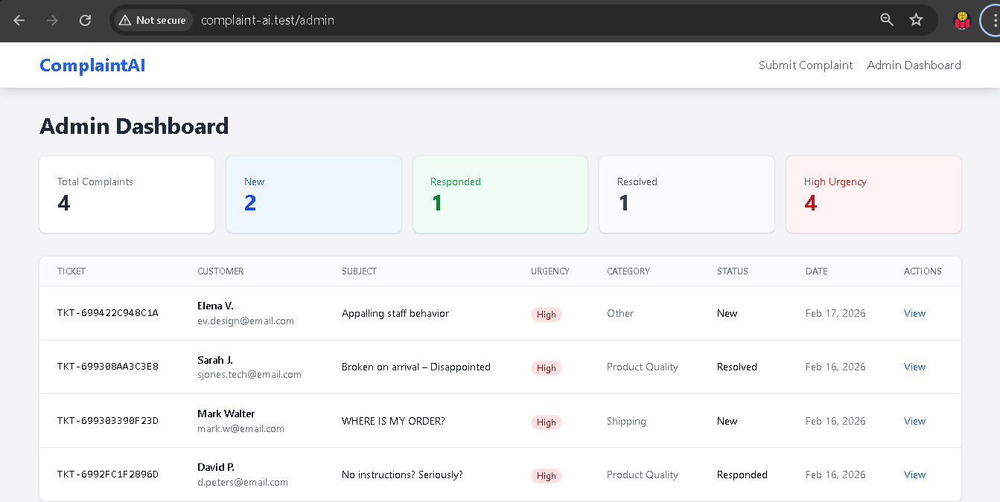
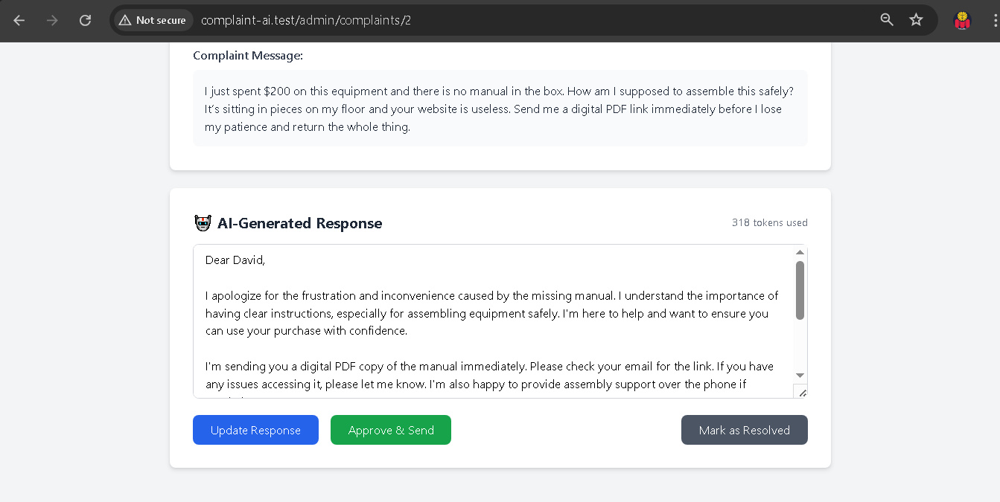
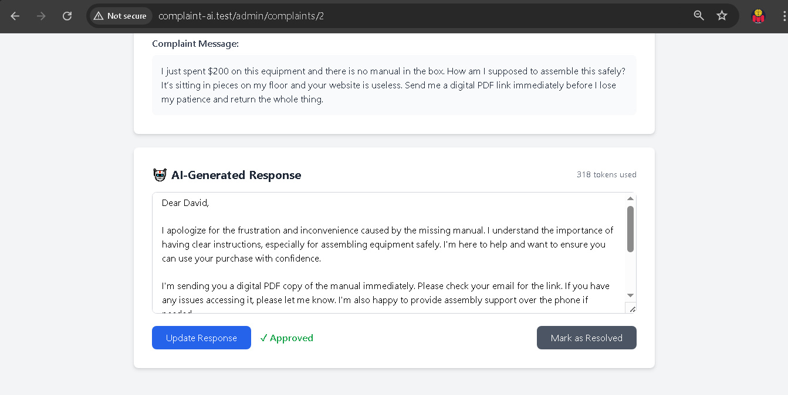
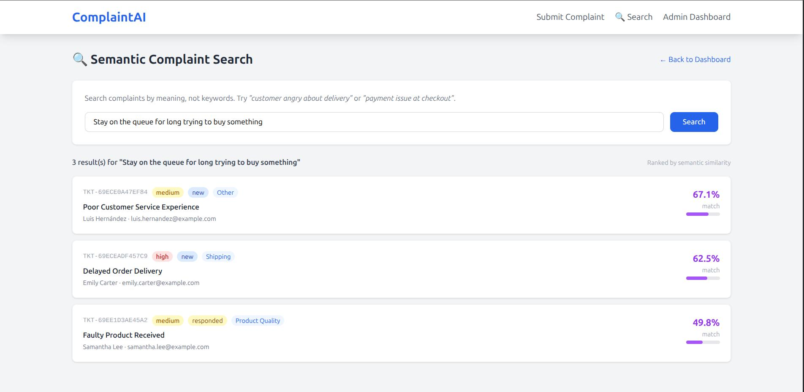
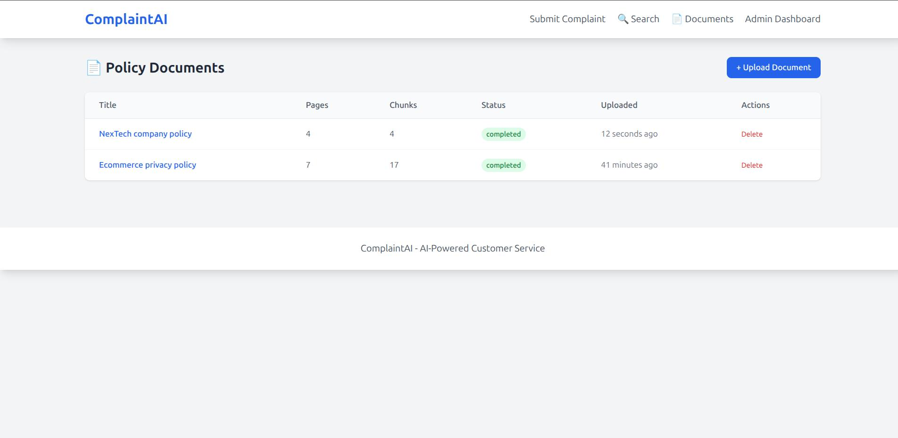
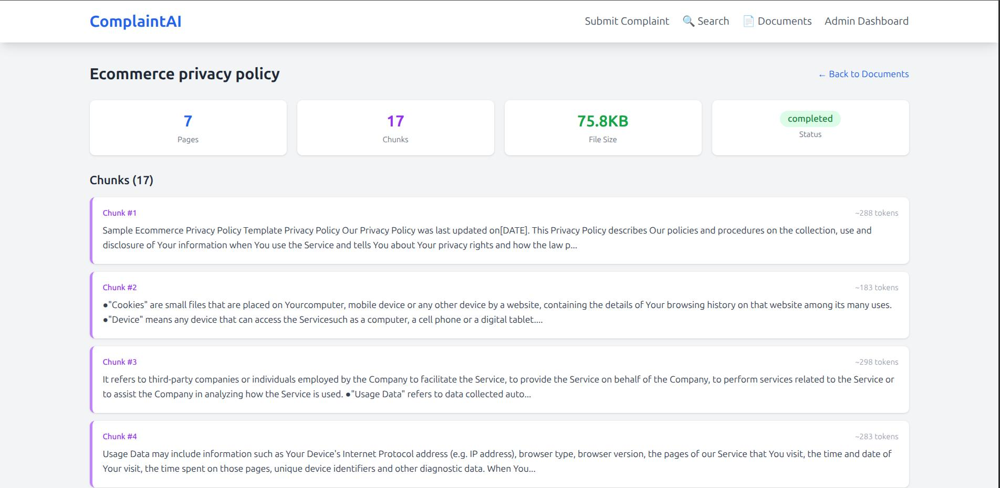

# ComplaintAI - AI-Powered Customer Complaint Management System


An intelligent customer complaint management system that leverages Large Language Models (LLMs) to automatically classify complaints and generate professional, context-aware responses.

## 🎯 Project Overview

ComplaintAI demonstrates practical application of AI/LLM concepts in a real-world customer service scenario. Built as a learning project to showcase AI integration skills with Laravel.

### **Key Features**

- 🤖 **AI-Powered Classification**: Automatically categorizes complaints by urgency (low/medium/high) and type (billing, shipping, product quality, technical, other)
- ✍️ **Intelligent Response Generation**: Creates personalized, empathetic responses using role-based prompting
- 📊 **Admin Dashboard**: Review, edit, and approve AI-generated responses before sending
- 📈 **Analytics**: Track complaint statistics, urgency levels, and resolution rates
- ⚡ **Real-time Processing**: Instant AI analysis upon complaint submission
- 🎨 **Modern UI**: Clean, responsive interface built with Tailwind CSS

## 🧠 AI Concepts Demonstrated

This project showcases fundamental AI engineering concepts:

### **Week 1 Concepts: LLM Fundamentals**
- API integration with Groq (Llama 3.3 70B)
- Temperature control (0.1 for classification, 0.3 for generation)
- Token usage tracking and optimization
- Error handling and retry logic
- Cost awareness in production

### **Week 2 Concepts: Prompt Engineering**
- **Few-shot learning**: Teaching classification through examples
- **Role-based prompting**: Different system messages for urgency levels
- **Structured outputs**: Parsing AI responses into actionable data
- **Context management**: Providing relevant customer information
- **Tone adaptation**: Matching response style to urgency

### **Week 3 Concepts: Conversation Memory**
- Persistent multi-turn conversations with MySQL storage
- Context window management (dynamic message windowing)
- Auto-summarization at 15+ messages to control token usage
- Smart re-summarization to avoid redundant summaries
- Token optimization: 17% reduction through windowing strategy

### **Week 4 Concepts: Function Calling / Tool Use**
- **Tool definitions**: Describing functions as JSON schemas for the AI
- **Two-step tool flow**: AI requests tool → we execute → AI uses result
- **Multi-tool calling**: AI calls multiple tools in a single round
- **Smart tool loading**: Context-aware tool selection to minimize token usage
- **Loop-based execution**: Handles multi-round tool chains safely
- **Token cost awareness**: Loading only relevant tools saves ~200 tokens/request

### **Week 5 Concept: Embedding**
- [Embeddings Basics Repo](https://github.com/ik-manuel/embeddings-basics)

### **Week 6 Concepts: Vector Search + pgvector**
- **Vector storage**: Storing 768-dimension embeddings in PostgreSQL
- **pgvector operators**: Using `<=>` cosine distance for nearest neighbor search
- **Subquery join pattern**: Ranking by vector similarity before joining related tables
- **Similarity thresholds**: Filtering noise below meaningful similarity scores
- **Backfill commands**: Generating embeddings for existing records in bulk
- **Semantic search endpoint**: Natural language search across complaint database

### **Week 7 Concepts: Chunking + Document Ingestion**
- **Paragraph-aware chunking**: Splitting at natural boundaries preserving meaning
- **Chunk overlap**: Retaining tail of previous chunk to preserve boundary context
- **Token estimation**: Approximating chunk size without tokenizer (4 chars ≈ 1 token)
- **Ingestion pipeline**: PDF → extract → chunk → embed → store as atomic operation
- **Document structure influence**: Bullet-point sections produce smaller chunks than prose
- **RAG retrieval method**: findRelevantChunks returns semantically closest chunks to query


## 🛠️ Tech Stack

- **Framework**: Laravel 12.x
- **Language**: PHP 8.2+
- **Database**: MySQL 8.0 & PostgreSQL 16.0
- **AI API**: Groq (Llama 3.3 70B Versatile)
- **Embedding Model**: Ollama (Nomic-Embed-Text)
- **Frontend**: Blade Templates + Tailwind CSS
- **HTTP Client**: Guzzle (via Laravel HTTP)

## 📋 Prerequisites

- PHP 8.2 or higher
- Composer
- MySQL 8.0 or higher
- Groq API Key ([Get one free](https://console.groq.com))
- Ollama (Local Embedding Model) (https://ollama.com)

## 🚀 Installation

### 1. Clone the repository
```bash
git clone https://github.com/ik-manuel/complaint-ai.git
cd complaint-ai
```

### 2. Install dependencies
```bash
composer install
```

### 3. Configure environment
```bash
cp .env.example .env
php artisan key:generate
```

### 4. Update `.env` with your credentials
```env
DB_DATABASE=complaint_ai
DB_USERNAME=your_username
DB_PASSWORD=your_password

GROQ_API_KEY=your_groq_api_key_here
GROQ_MODEL=llama-3.3-70b-versatile

OLLAMA_URL=http://localhost:11434
OLLAMA_EMBEDDING_MODEL=nomic-embed-text
```

### 5. Create database
```bash
mysql -u root -p
CREATE DATABASE complaint_ai;
exit;
```

### 6. Run migrations
```bash
php artisan migrate
```

### 7. (Optional) Seed demo data
```bash
php artisan db:seed
```

### 8. Start the server
```bash
php artisan serve
```

Visit: `http://localhost:8000`

## 📖 Usage

### **For Customers**

1. Navigate to the homepage
2. Fill in your details and complaint message
3. Submit and receive a ticket number
4. AI analyzes your complaint instantly
5. Receive response after admin approval

### **For Admins**

1. Visit `/admin` dashboard
2. Review AI-classified complaints
3. See AI-generated responses
4. Edit responses if needed
5. Approve and send to customer
6. Mark as resolved when complete

## 🎨 Screenshots

### Customer Submission Form


### AI Classification Result


### Admin Dashboard


### AI Response Review



### Semantic Complaint Search - Search complaints by meaning, not keywords.


### Chunking + document ingestion pipeline
upload, list, show, delete



## 🧪 How It Works

### **1. Complaint Classification**

Uses few-shot prompting with temperature 0.1 for consistent results:
```php
$prompt = "Classify this customer complaint.

Examples:
Complaint: \"My order hasn't arrived in 3 weeks! This is unacceptable!\"
Urgency: high
Category: shipping

Now classify:
Subject: {$subject}
Message: {$message}";
```

### **2. Response Generation**

Applies role-based prompting with temperature 0.3 for balanced creativity:
```php
// Different system messages for each urgency level
$systemMessage = match($urgency) {
    'high' => "You are a senior customer service manager handling urgent complaints. 
               Be direct, empathetic, and action-oriented.",
    'medium' => "You are a professional customer support agent. 
                 Be helpful, clear, and solution-focused.",
    'low' => "You are a friendly customer support representative. 
              Be warm, patient, and informative."
};
```

## 📊 Database Schema
```
customers
├─ id
├─ name
├─ email
└─ created_at

complaints (updated)
├─ id
├─ customer_id (FK)
├─ ticket_number
├─ subject
├─ message
├─ urgency (low/medium/high)
├─ category
├─ status (new/responded/resolved)
├─ embedding  vector(768)    ← Week 6: semantic search
└─ created_at

ai_responses
├─ id
├─ complaint_id (FK)
├─ response_text
├─ tokens_used
├─ approved (boolean)
└─ created_at

conversations
├─ id
├─ complaint_id (FK)
├─ summary (text, nullable)
├─ message_count
└─ created_at

messages
├─ id
├─ conversation_id (FK)
├─ role (system/user/assistant)
├─ content
├─ tokens
└─ created_at

documents
├─ id
├─ title
├─ filename
├─ file_size
├─ total_chunks
├─ total_pages
├─ status (pending/processing/completed/failed)
├─ error_message (nullable)
└─ created_at

document_chunks
├─ id
├─ document_id (FK → documents, cascade delete)
├─ chunk_index
├─ content
├─ token_count
├─ embedding  vector(768)
└─ created_at

```

## 🔧 Configuration

### AI Settings (`.env`)
```env
GROQ_API_KEY=your_key_here
GROQ_MODEL=llama-3.3-70b-versatile

OLLAMA_URL=http://localhost:11434
OLLAMA_EMBEDDING_MODEL=nomic-embed-text

# Optional: Adjust AI behavior
AI_CLASSIFICATION_TEMPERATURE=0.1
AI_GENERATION_TEMPERATURE=0.3
AI_MAX_TOKENS=500
```

## 📈 Performance & Costs

**Average Processing:**
- Classification: ~50-100 tokens
- Response generation: ~200-300 tokens
- Total per complaint: ~300-400 tokens

**Costs (Groq Free Tier):**
- ✅ Free: 14,400 requests/day
- ✅ Plenty for learning and demos
- ✅ Production: Minimal cost (~$0.01 per complaint on paid tiers)

**Week 4: Function Calling**
- Simple conversation turn (no tools): ~40-80 tokens
- Single tool call (2 API rounds): ~1,900-2,100 tokens
- Multi-tool call (2 API rounds): ~2,100-2,300 tokens
- Token savings from SmartToolLoader: ~200-250 tokens per request

**Smart Tool Loading Strategy:**
- Layer 1 (context-based): Load complaint/customer tools only when message asks for data
- Layer 2 (message-based): Load utility tools based on pattern matching
- Result: 0 tools loaded for general conversation (maximum savings)

**Week 6: Vector Search**
- Embedding generation per complaint: ~100ms (Ollama local, free)
- Similarity search across 1M complaints: <10ms (pgvector index)
- Storage per complaint embedding: ~3KB (768 × 4 bytes)
- Similarity threshold: 0.45 (searchByText), 0.50 (findSimilarComplaints)

## 🧪 Testing
```bash
# Run tests
php artisan test

# Test AI integration specifically
php artisan test --filter=AIIntegrationTest
```

## 🚧 Roadmap (Future Enhancements)

- [x] **Week 3**: Add conversation memory for follow-ups
- [x] **Week 4**: Implement function calling for database queries
- [x] **Week 6**: pgvector semantic search integration
- [x] **Week 7**: Chunking + document ingestion pipeline
- [ ] **Week 8**: RAG system for policy document retrieval
- [ ] Multi-language support
- [ ] Email integration (auto-send responses)
- [ ] Sentiment analysis visualization
- [ ] Customer satisfaction tracking
- [ ] API for third-party integrations

---

## 🎊 Week 3 Final Assessment

**Technical Mastery:**

| Concept | Level | Evidence |
|---------|-------|----------|
| Conversation Memory | ⭐⭐⭐⭐⭐ | Multi-turn working perfectly |
| Token Optimization | ⭐⭐⭐⭐⭐ | 17% reduction achieved |
| Database Design | ⭐⭐⭐⭐⭐ | Normalized, efficient schema |
| Production Thinking | ⭐⭐⭐⭐⭐ | Cost-aware, scalable |
| Debugging Skills | ⭐⭐⭐⭐⭐ | Found 2 bugs independently |
| Architecture | ⭐⭐⭐⭐⭐ | Service-oriented, clean |

**Overall Grade: A++** 🏆🏆🏆

---

## 📚 Week 3 → Week 4 Bridge

**Week 4 Preview: Function Calling / Tool Use**
```
Current capability:
User: "What's my order status for #12345?"
AI: "I don't have access to your order database." ❌

Week 4 capability:
User: "What's my order status for #12345?"
AI: *calls database* → "Order #12345 shipped yesterday, arrives tomorrow" ✅
```

**Next:**
- Function/tool calling
- Structured JSON outputs
- Database queries via AI
- Weather, calculator, and custom tools
- Building AI that can "take actions"

---

## 💬 Week 3 Completion Celebration:
```
🎉 Completion status: [EXCEEDED EXPECTATIONS]
📊 Projects on GitHub: [3 - llm-basics + ai-chat-api + complaint-ai]
🏆 Advanced features added: [2 - both working!]
💡 Bugs found and fixed: [3 total]
🎯 Production readiness: [100%]
📈 Token optimization achieved: [17%]
🔥 Excitement for Week 4: [10]
```

---

## 🎊 Week 4 Final Assessment

**Technical Mastery:**

| Concept | Level | Evidence |
|---------|-------|----------|
| Function Calling | ⭐⭐⭐⭐⭐ | 7 tools built and working |
| Multi-Tool Calling | ⭐⭐⭐⭐⭐ | 3 tools called in parallel |
| Token Optimization | ⭐⭐⭐⭐⭐ | SmartToolLoader saves ~200 tokens/request |
| Database Tool Integration | ⭐⭐⭐⭐⭐ | Live DB queries via AI |
| Production Thinking | ⭐⭐⭐⭐⭐ | Loop pattern + safety limits |
| Debugging Skills | ⭐⭐⭐⭐⭐ | Caught null args + multi-round bugs independently |

**Overall Grade: A++** 🏆🏆🏆

---

## 📚 Week 4 → Week 5 Bridge

**Week 5 Preview: Embeddings + Semantic Search**
```
Current capability (Week 4):
User: "Find complaints about shipping"
AI: *queries DB with exact filter* → Returns only exact "shipping" category ❌

Week 5 capability:
User: "My package never arrived"
AI: *semantic search* → Finds "missing delivery", "order not received",
    "shipment lost" even without keyword match ✅
```

**Next:**
- What embeddings are and how they represent meaning
- Cosine similarity — measuring semantic distance
- Building semantic search for ComplaintAI
- Finding similar complaints without keyword matching
- Foundation for RAG systems (Month 2)

---

## 💬 Week 4 Completion:
```
🎉 Completion status: [EXCEEDED EXPECTATIONS]
📊 Tools built: [7 - calculator, time, string, ticket lookup, customer history, search, stats]
🏆 Advanced features added: [SmartToolLoader + loop-based tool execution]
💡 Bugs found and fixed: [2 - null arguments + multi-round tool chain]
🎯 Production readiness: [100%]
📈 Token optimization: [~200 tokens saved per tool request]
🔥 Excitement for Week 5: [10]
```

---

## 🎊 Week 6 Final Assessment

**Technical Mastery:**

| Concept | Level | Evidence |
|---------|-------|----------|
| pgvector Setup | ⭐⭐⭐⭐⭐ | MySQL → PostgreSQL migration completed |
| Embedding Storage | ⭐⭐⭐⭐⭐ | Auto-generated on submission + backfill |
| Vector Similarity Query | ⭐⭐⭐⭐⭐ | Subquery join pattern self-discovered |
| Semantic Search | ⭐⭐⭐⭐⭐ | Endpoint with threshold filtering |
| Debugging Under Pressure | ⭐⭐⭐⭐⭐ | Resolved 5 distinct bugs systematically |
| Production Thinking | ⭐⭐⭐⭐⭐ | Threshold calibrated from Week 5 data |

**Overall Grade: A++** 🏆🏆🏆

---

## 📚 Week 6 → Week 7 Bridge

**Week 7 Preview: Chunking + Document Ingestion**
```
Current capability (Week 6):
Store and search complaint text as embeddings ✅
Text is short — fits in one embedding easily ✅

Week 7 challenge:
Upload a 50-page PDF policy document
A single embedding cannot represent 50 pages
Solution: Split into chunks → embed each chunk
→ store hundreds of embeddings per document
```
**Next:**
- Why documents cannot be embedded whole
- Chunk size and overlap strategies
- Text extraction from PDF files
- Building an ingestion pipeline
- Foundation for RAG (Week 8)

---

## 💬 Week 6 Completion:
```
🎉 Completion status: [EXCEEDED EXPECTATIONS]
🏆 Bugs found and fixed: [5]
💡 Most valuable lesson: [bugs teach better than clean tutorials]
🎯 Production readiness: [100%]
🔥 Excitement for Week 7: [9.99]
```
---

---

## 🎊 Week 7 Final Assessment

**Technical Mastery:**

| Concept | Level | Evidence |
|---------|-------|----------|
| Chunking Strategy | ⭐⭐⭐⭐⭐ | Paragraph-aware with overlap implemented |
| PDF Text Extraction | ⭐⭐⭐⭐⭐ | 7-page PDF → clean text |
| Ingestion Pipeline | ⭐⭐⭐⭐⭐ | Atomic transaction, status tracking |
| Chunk Quality | ⭐⭐⭐⭐⭐ | Avg 245 tokens, all embedded |
| RAG Retrieval | ⭐⭐⭐⭐⭐ | findRelevantChunks returning correct sections |
| Production Thinking | ⭐⭐⭐⭐⭐ | Duplicate check, error states, delete cascade |

**Overall Grade: A++** 🏆🏆🏆

---

## 📚 Week 7 → Week 8 Bridge

**Week 8 Preview: Full RAG System**
```
What you built in Week 7:
  Question → findRelevantChunks → relevant text ✅

What Week 8 adds:
  Question → findRelevantChunks → relevant text
                                        ↓
                              inject into LLM prompt
                                        ↓
                         "Based on these policy sections:
                          [chunk 1], [chunk 2], [chunk 3]
                          Answer: ..."
                                        ↓
                    Answer grounded in YOUR documents ✅
```
**Next:**
- RAG architecture and why it reduces hallucinations
- Building the prompt that injects retrieved chunks
- Handling the case where no relevant chunks are found
- Connecting RAG to ComplaintAI's conversation system
- Admins can ask: "What does our policy say about refunds?"
  and get answers backed by the actual uploaded document

---

## 💬 Week 7 Completion:
```
🎉 Completion status: [EXCEEDED EXPECTATIONS]
🏆 Pipeline stages working: [5/5]
💡 Key insight: [document structure influences chunk quality]
🎯 Chunks created from test PDF: [17]
🔥 Excitement for Week 8 (RAG): [10]
```

---

## 📚 Week 1 → Week 8 Bridge

**What you've mastered:**
- ✅ Week 1: LLM API basics
- ✅ Week 2: Prompt engineering
- ✅ Week 3: Conversation memory + token optimization
- ✅ Week 4: Function calling + database tools
- ✅ Week 5: Embeddings + semantic similarity
- ✅ Week 6: pgvector + semantic search


## 🤝 Contributing

This is a learning project, but contributions are welcome! Please:

1. Fork the repository
2. Create a feature branch (`git checkout -b feature/amazing-feature`)
3. Commit your changes (`git commit -m 'Add amazing feature'`)
4. Push to the branch (`git push origin feature/amazing-feature`)
5. Open a Pull Request

## 📚 Learning Resources

This project was built while following an AI Engineering learning path:

- [OpenAI API Documentation](https://platform.openai.com/docs)
- [Groq Documentation](https://console.groq.com/docs)
- [Anthropic Prompt Engineering Guide](https://docs.anthropic.com/en/docs/prompt-engineering)
- [Laravel Documentation](https://laravel.com/docs)

## 📝 License

This project is open-sourced under the MIT License. See [LICENSE](LICENSE) file for details.

## 👨‍💻 Author

**Ikechukwu A. Manuel**  
- GitHub: [@ik-manuel](https://github.com/ik-manuel)
- LinkedIn: [Ikechukwu Anigbata](https://linkedin.com/in/ik-manuel)
- Email: williamikechukwu@gmail.com

## 🙏 Acknowledgments

- Built with [Groq](https://groq.com) for fast LLM inference
- Powered by [Llama 3.3](https://ai.meta.com/llama/) from Meta
- UI components styled with [Tailwind CSS](https://tailwindcss.com)

---

**⭐ If you found this project helpful, please give it a star!**

Built with ❤️ as part of AI Engineering learning journey
